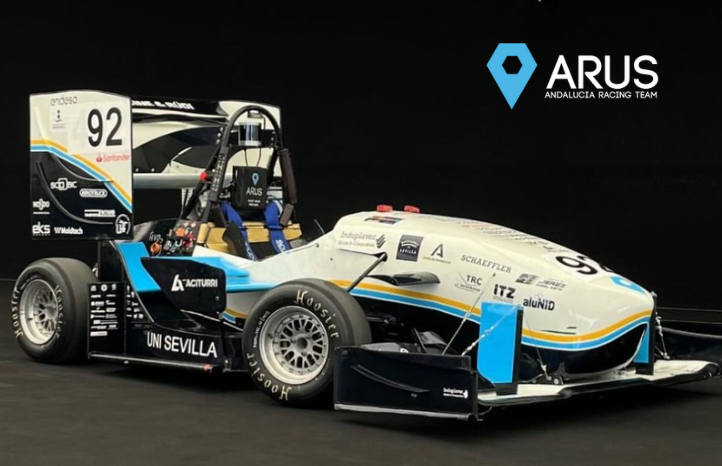
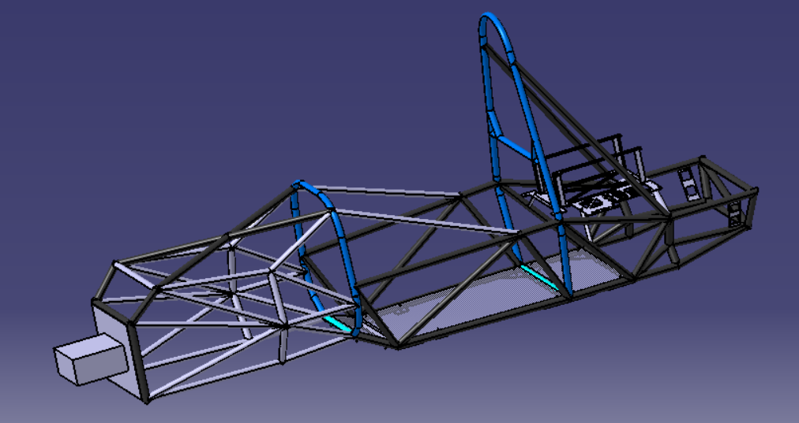
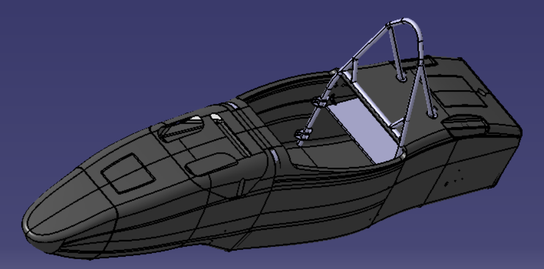
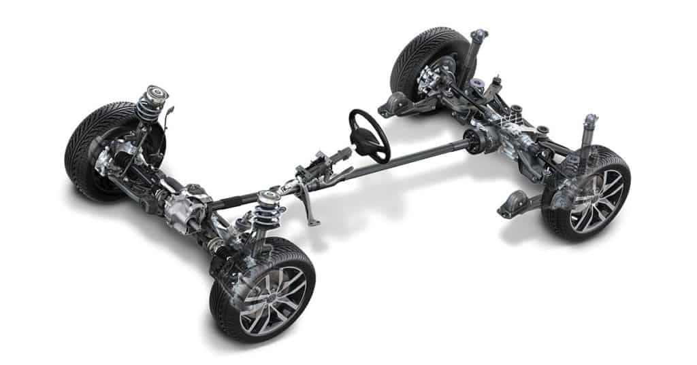
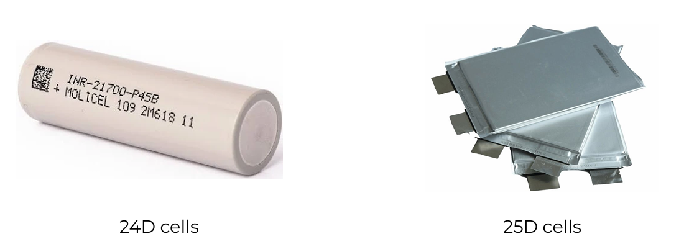

```{r setup, include=FALSE}
knitr::opts_chunk$set(echo = TRUE)
```

```{r,echo=FALSE,message=FALSE,warning=FALSE}
library(dplyr)
library(tidyr)
library(tidyverse)
library(knitr)
library(kableExtra)

```

```{r,echo=FALSE,message=FALSE}
source("Funciones/teoriadecision_funciones_multicriterio.R")
source("Funciones/teoriadecision_funciones_multicriterio_diagram.R")
source("Funciones/teoriadecision_funciones_multicriterio_utiles.R")
```

\newpage

# Introducción

La Formula Student es la competición más prestigiosa a nivel ingenieril
del mundo. Es por eso que los distintos equipos buscan continuamente
mejoras que optimicen el rendimiento de sus monoplazas. Sin embargo,
debido a los recursos limitados y múltiples amplio abanico de mejoras,
elegir la más adecuada es un desafío. Este trabajo propone un enfoque de
decisiones multicriterio para identificar la mejora óptima, evaluando
factores como el rendimiento, el costo y el peso.

<center>

{width="400"}

</center>

ARUS es el equipo de Formula Student de la Universidad de Sevilla y del
cual vamos a realizar el trabajo.

[*(ARUS web)*](https://www.arusteam.com/)

# Criterios

Para la elección de la mejora más óptima tenemos que tener en cuanta
distintos criterios, en este caso los hemos resumidos en los siguientes
6.

**1. Peso Total del Monoplazas**

Este criterio afecta directamente en la aceleración y frenado del
monoplazas, además también tiene un impacto directo en el comportamiento
de este en las curvas. Es un criterio ***desfavorable*** en el sentido
de que queremos mínimizar el peso.

**2. Coste de Fabricación**

Al tratarse de un equipo de universidad disponemos de un límite
presupuestario, por lo que siempre buscamos una opción económica y
asequible. También es un criterio en el que buscaremos el ***mínimo***.

**3. Fiabilidad y Seguridad**

Valorar la robustez de la mejora propuesta y su impacto en la seguridad
del piloto, asegurando que el cambio no comprometa la durabilidad del
vehículo ni los estándares de seguridad, todo debe cumplir las reglas
que la competición de Alemania (FSG) determina. [*(enlace a la
normativa)*](https://www.formulastudent.de/fileadmin/user_upload/all/2025/rules/FS-Rules_2025_v1.0.pdf)*.*

**4. Innovación**

Este criterio considera el grado de creatividad y originalidad de la
mejora, su potencial para introducir tecnologías o conceptos innovadores
y la posibilidad de marcar la diferencia en la competición con un diseño
único y eficiente. Existe un premio específico para el equipo más
innovador de la temporada.

**5. Evaluación de riesgos**

Análisis de los riesgos técnicos y operativos asociados a la
implementación de las distintas mejoras. Se consideran posibles fallos o
problemas que puedan surgir, así como el impacto que podrían tener en el
rendimiento o la seguridad del vehículo. Se requiere establecer un plan
de gestión de riesgos para mitigar los efectos adversos y reducir la
probabilidad de problemas en competencia.

**6. Sostenibilidad**

La sostenibilidad es cada vez más importante en el mundo actual esto se
ve reflejado en la competición de Formula Student. Este criterio evalúa
el impacto ambiental de los materiales, procesos y recursos utilizados
para implementar las mejoras en estudio. Se priorizarán materiales
reciclables y técnicas de fabricación ecoeficientes, buscando reducir la
huella de carbono.

\newpage

# Mejoras

Serán las alternativas que evaluaremos en cada uno de los criterios que
hemos mencionado anteriormente. Veamos estas de forma detallada.

**1. Monocasco**

Durante la temporada 24 y anteriormente en el equipo siempre se ha
realizado un meneplazas cuyo chasis era tubular.

{width="400"}

Consiste en una red de tubos de acero o aluminio soldados entre sí.

Se está planteando la opción de cambiar el diseño de este chasis a un
monocasco, siguiendo la tendencia adoptada por varios equipos de Formula
Student. Al adoptar un chasis monocasco, no solo reducimos
significativamente el peso del vehículo, sino que también incrementamos
la rigidez estructural, lo cual mejora el comportamiento dinámico del
mismo.

{width="400"} \newpage

**2. Tracción a las 4 rueda**

Conocido y llamado a partir de ahora como 4WD(4 Wheel Drive). Consiste
en lugar de tener un único motor, colocar uno en cada rueda. Este cambio
mejorará la aceleración, el control y la estabilidad en curvas al
distribuir la potencia en las cuatro ruedas, optimizando el agarre en
cualquier condición de pista.

{width="400"}

**3. Optimización de la batería**

Cambio de celdas, antes eran cilíndricas y se pretende pasar a las que
se pueden ver en la derecha, estas ocupan mucho menos sitio haciendo que
el computo general de la batería tenga un peso menor al de la temporada
de 2024. Además de un cambio en la configuración de la misma.

{width="400"}

**4. Telemetría**

Sistema de monitorización en tiempo real que recolecta y transmite los
datos de los distintos componentes del vehículo hacia una estación
remota, permitiendo detectar posibles problemas en directo. Además de la
necesidad de conectar un sensor proporcionado por la misma competición
llamado *dattalogger* que recoge todo estos datos.

**5. Diseño de Nuevas Aletas y Difusores para Aerodinámica** Busca
optimizar el flujo de aire alrededor del vehículo para mejorar el agarre
y la estabilidad. Este sistema se centra en controlar la distribución de
fuerzas aerodinámicas, aumentando la eficiencia y el rendimiento.

\newpage

# AHP

En primer lugar vamos a hacer una matriz que contenga la información al
comparar los distintos ***criterios***:

```{r,echo=FALSE,warning=FALSE}
criterios= c ("Peso","Coste","Fiabilidad","Innovación","Riesgo","Sostenibilidad")
tablacriterios= multicriterio.crea.matrizvaloraciones_mej(
  c(1/2,2,7,4,6,4,9,6,7,5,2,4,1/4,1/2,2), numalternativas = 6, v.nombres.alternativas = criterios)
tablacriterios %>%
  kable(booktabs = TRUE,digits = 2) %>%
  kable_styling(latex_options = c("striped", "condensed","HOLD_position", "scale_down"), 
                position = "center",
                full_width = FALSE)
```

Ahora se hará una matriz para cada uno de los criterios haciendo
comparaciones dos a dos sobre las distintas alternativas yy ver cual es
preferible a cual, buscando simepre una estructura coherente y
respetando la relación de coherencia.

```{r,echo=FALSE}
alternativas= c("Monocasco","4WD","Batería","Telemetría","Aerodinámica")
```

-   **Peso Total del Monoplazas**

```{r,echo=FALSE,warning=FALSE}
peso= multicriterio.crea.matrizvaloraciones_mej(
  c(2,7,9,3,4,6,2,2,1/2,1/6),numalternativas = 5,
  v.nombres.alternativas = alternativas)
peso %>%
  kable(booktabs = TRUE,digits = 2) %>%
  kable_styling(latex_options = c("striped", "condensed","HOLD_position", "scale_down"), 
                position = "center",
                full_width = FALSE)
```

-   **Coste de Fabricación**

```{r,echo=FALSE,warning=FALSE}
coste= multicriterio.crea.matrizvaloraciones_mej(
  c(1,1/8,1/6,1/3,1/8,1/7,1/3,2,6,2),numalternativas = 5,
  v.nombres.alternativas = alternativas)
coste %>%
  kable(booktabs = TRUE,digits = 2) %>%
  kable_styling(latex_options = c("striped", "condensed","HOLD_position", "scale_down"), 
                position = "center",
                full_width = FALSE)
```

-   **Fiabilidad y seguridad**

```{r,echo=FALSE,warning=FALSE}
fiabilidad= multicriterio.crea.matrizvaloraciones_mej(
  c(1/7,1/4,1/9,1/2,2,1/2,6,1/3,2,6),numalternativas = 5,
  v.nombres.alternativas = alternativas)
fiabilidad %>%
  kable(booktabs = TRUE,digits = 2) %>%
  kable_styling(latex_options = c("striped", "condensed","HOLD_position", "scale_down"), 
                position = "center",
                full_width = FALSE)
```

-   **Innovación**

```{r,echo=FALSE,warning=FALSE}
innovacion= multicriterio.crea.matrizvaloraciones_mej(
  c(4,4,2,8,1,1/2,4,1/2,2,7),numalternativas = 5,
  v.nombres.alternativas = alternativas)
innovacion %>%
  kable(booktabs = TRUE,digits = 2) %>%
  kable_styling(latex_options = c("striped", "condensed","HOLD_position", "scale_down"), 
                position = "center",
                full_width = FALSE)
```

-   **Evaluación de riesgo**

```{r,echo=FALSE,warning=FALSE}
riesgo= multicriterio.crea.matrizvaloraciones_mej(
  c(1/2,1/4,1/6,3,1/2,1/6,4,1/2,7,9),numalternativas = 5,
  v.nombres.alternativas = alternativas)
riesgo %>%
  kable(booktabs = TRUE,digits = 2) %>%
  kable_styling(latex_options = c("striped", "condensed","HOLD_position", "scale_down"), 
                position = "center",
                full_width = FALSE)
```

-   **Sostenibilidad**

```{r,echo=FALSE,warning=FALSE}
sostenibilidad= multicriterio.crea.matrizvaloraciones_mej(
  c(1/2,2,1/6,1/3,3,1/5,1/3,1/9,1/7,2),numalternativas = 5,
  v.nombres.alternativas = alternativas)
sostenibilidad %>%
  kable(booktabs = TRUE,digits = 2) %>%
  kable_styling(latex_options = c("striped", "condensed","HOLD_position", "scale_down"), 
                position = "center",
                full_width = FALSE)
```

## Método I: Funciones de clase

### Mayor autovalor

**Pesos locales** **Pesos locales**

```{r}
wcriterios = multicriterio.metodoAHP.variante1.autovectormayorautovalor(tablacriterios)

```

*nota: De forma análoga para todos los criterios*

```{r,echo=FALSE}
wcriterios = multicriterio.metodoAHP.variante1.autovectormayorautovalor(tablacriterios)
wpeso = multicriterio.metodoAHP.variante1.autovectormayorautovalor(peso)
wcoste = multicriterio.metodoAHP.variante1.autovectormayorautovalor(coste)
wfiabilidad = multicriterio.metodoAHP.variante1.autovectormayorautovalor(fiabilidad)
winnovacion = multicriterio.metodoAHP.variante1.autovectormayorautovalor(innovacion)
wriesgo = multicriterio.metodoAHP.variante1.autovectormayorautovalor(riesgo)
wsostenibilidad = multicriterio.metodoAHP.variante1.autovectormayorautovalor(sostenibilidad)

```

**Pesos globales**

```{r,echo=FALSE}
tabla1 = multicriterio.metodoAHP.pesosglobales_entabla(wcriterios$valoraciones.ahp, 
                                                       rbind(wpeso$valoraciones.ahp,
                                                             wcoste$valoraciones.ahp,
                                                             wfiabilidad$valoraciones.ahp,
                                                             winnovacion$valoraciones.ahp,
                                                             wriesgo$valoraciones.ahp,
                                                             wsostenibilidad$valoraciones.ahp))
```

```{r,echo=FALSE}
tabla1 %>%
  kable(booktabs = TRUE) %>%
  kable_styling(latex_options = c("striped", "condensed","HOLD_position", "scale_down"), 
                position = "center",
                full_width = FALSE)

```

### Media geométrica

**Pesos locales**

```{r}
wcriterios = multicriterio.metodoAHP.variante2.mediageometrica(tablacriterios)

```

*nota: De forma análoga para todos los criterios*

```{r,echo=FALSE}
wpeso = multicriterio.metodoAHP.variante2.mediageometrica(peso)
wcoste = multicriterio.metodoAHP.variante2.mediageometrica(coste)
wfiabilidad = multicriterio.metodoAHP.variante2.mediageometrica(fiabilidad)
winnovacion = multicriterio.metodoAHP.variante2.mediageometrica(innovacion)
wriesgo = multicriterio.metodoAHP.variante2.mediageometrica(riesgo)
wsostenibilidad = multicriterio.metodoAHP.variante2.mediageometrica(sostenibilidad)
```

**Pesos globales**

```{r,echo=FALSE}
tabla2 = multicriterio.metodoAHP.pesosglobales_entabla(wcriterios$valoraciones.ahp, 
                                                       rbind(wpeso$valoraciones.ahp,
                                                             wcoste$valoraciones.ahp,
                                                             wfiabilidad$valoraciones.ahp,
                                                             winnovacion$valoraciones.ahp,
                                                             wriesgo$valoraciones.ahp,
                                                             wsostenibilidad$valoraciones.ahp))
```

```{r,echo=FALSE}
tabla2 %>%
  kable(booktabs = TRUE) %>%
  kable_styling(latex_options = c("striped", "condensed","HOLD_position", "scale_down"), 
                position = "center",
                full_width = FALSE)

```

### Método básico

**Pesos locales**

```{r}
wcriterios = multicriterio.metodoAHP.variante3.basico(tablacriterios)

```

*nota: De forma análoga para todos los criterios*

```{r,echo=FALSE}
wpeso = multicriterio.metodoAHP.variante3.basico(peso)
wcoste = multicriterio.metodoAHP.variante3.basico(coste)
wfiabilidad = multicriterio.metodoAHP.variante3.basico(fiabilidad)
winnovacion = multicriterio.metodoAHP.variante3.basico(innovacion)
wriesgo = multicriterio.metodoAHP.variante3.basico(riesgo)
wsostenibilidad = multicriterio.metodoAHP.variante3.basico(sostenibilidad)
```

**Pesos globales**

```{r,echo=FALSE}
tabla3 = multicriterio.metodoAHP.pesosglobales_entabla(wcriterios$valoraciones.ahp, 
                                                       rbind(wpeso$valoraciones.ahp,
                                                             wcoste$valoraciones.ahp,
                                                             wfiabilidad$valoraciones.ahp,
                                                             winnovacion$valoraciones.ahp,
                                                             wriesgo$valoraciones.ahp,
                                                             wsostenibilidad$valoraciones.ahp))
```

```{r,echo=FALSE}
tabla3 %>%
  kable(booktabs = TRUE) %>%
  kable_styling(latex_options = c("striped", "condensed","HOLD_position", "scale_down"), 
                position = "center",
                full_width = FALSE)

```

***Conclusión:*** Podemos ver que independientemente del método de
cálculo de los pesos locales la mejora más óptima para implementar es
***Optimización de la batería*** con un peso global:

-   Método mayor autovalor: 28,503% aproximadamente
-   Media geométrica: 28,193%
-   Método básico: 28,065%

Además se verifica que para todos los criterios la mejora menos óptima
es la de diseño de nuevas aletas y difusores para ***Aerodinámica.***

## Método II

```{r, echo=FALSE}
num.alt = 5
num.crt = 6
Xarray_nivel2 = array (NA, dim=c(num.alt, num.alt, num.crt))
Xarray_nivel2[,,1] = peso
Xarray_nivel2[,,2] = coste
Xarray_nivel2[,,3] = fiabilidad
Xarray_nivel2[,,4] = innovacion
Xarray_nivel2[,,5] = riesgo
Xarray_nivel2[,,6] = sostenibilidad
paso1 = multicriterio.metodoAHP.variante3.completo(tablacriterios,Xarray_nivel2)
sol_m2 = paso1$pesos.globales_entabla
```

```{r,echo=FALSE}
sol_m2 %>%
  kable(booktabs = TRUE) %>%
  kable_styling(latex_options = c("striped", "condensed","HOLD_position", "scale_down"), 
                position = "center",
                full_width = FALSE)


```

## Diagrama Jerarquías

```{r, echo=FALSE, fig.align='center'}
num.alt = 5
num.crt = 6
Xmatriznivel2 = array (NA, dim=c(num.alt, num.alt, num.crt))
Xmatriznivel2[,,1] = peso
Xmatriznivel2[,,2] = coste
Xmatriznivel2[,,3] = fiabilidad
Xmatriznivel2[,,4] = innovacion
Xmatriznivel2[,,5] = riesgo
Xmatriznivel2[,,6] = sostenibilidad
dimnames(Xmatriznivel2)[[1]] = alternativas
multicriterio.metodoahp.diagrama(tablacriterios, Xmatriznivel2)
```

No se ve de forma muy clara en este diagrama ya que está toda la
información muy condensada.

## Paquete AHP

```{r,echo=FALSE, warning=FALSE}
library(ahp)
datos = Load("AHP/datos.ahp")
Calculate(datos)
```

```{r,echo=FALSE}
Visualize(datos)
```

**Contribución total**

```{r,echo=FALSE,fig.align='center'}
export_formattable(AnalyzeTable(datos), file = "AHP/tablaAHPp1.png")
```

**Pesos locales**

```{r, echo=FALSE,fig.align='center'}
tabla2 = AnalyzeTable(datos, variable = "priority")
export_formattable(tabla2, file = "AHP/tablaAHP2.png")
```

**Análisis de las Tablas AHP**

-   Contribución Total de los Criterios

La primera tabla muestra la contribución total de cada criterio en la
selección de la mejora óptima para el monoplaza. El criterio con mayor
peso es:

Coste (43.1%): Es el criterio más importante, con una alta prioridad en
general. En este criterio, la opción de "Batería" lidera, contribuyendo
con el 50.5% de peso para que esta alternativa se posicione como la más
óptima.

De forma similar puede verse esto para el resto de criterios hasta
llegar al criterio con menor peso que es la innovación con tan solo un
3.1%.

Los valores de inconsistencia son bajos, entre el 1.3% y 2.3%, lo que
indica que las evaluaciones y comparaciones dentro de cada criterio se
hecho de manera coherente.

-   Pesos Locales por Criterio En la segunda tabla, se detallan los
    pesos locales, que reflejan la importancia de cada opción dentro de
    cada criterio específico. Cabe destacar los siguientes datos. Dentro
    del criterio Coste: La opción de "Batería" es la más relevante, con
    un peso local del 28.5%.

Fijándonos en el peso vemos que la implementación de un Monocasco es la
alternativa preferible para minimizar este mismo criterio, cosa que es
evidente ya que supondría una gran mejora pues como se ha comentado
anteriormente un monocasco de fibra de carbono supondría una gran
diferencia de peso frente al chasis tabular de acero de la temoporada
pasada, colocandose así con un peso del 12.0% en este criterio.

**Conclusión**

Finalmente se puede concluir de forma general las opciones pueden
ordenarse de más óptima es hacer un estido de la configuración para
***optimizar la batería***, esta opción lidera en el criterio "Coste"
como ya hemos comentado antes y la opción más consistente en el resto de
criterios. Por lo tanto, para las prioridades globales, las mejoras
deberían enfocarse en Batería y Monocasco, seguidas por Telemetría.

\newpage

# ELECTRE

Dados las siguiente tabla de datos con cada uno de los criterios que
tienen peso: 43% , 26% , 14%, 8.3%, 4.8%, 3.18% respectivamente

| Criterio | Min/Max | Monocasco | 4WD | Batería | Telemetría | Aerodinámica | Tipo | Parámetros |
|--------|--------|--------|--------|--------|--------|--------|--------|--------|
| Peso (kg) | Min | 78 | 40 | 4 | 0 | 40 | III | p=25 |
| Coste (miles € ) | Min | 12 | 2 | 3,5 | 0,5 | 5 | V | q=0,75 p=8 |
| Fiabilidad | Max | 1 | 4 | 3 | 5 | 2 | II | q=15 |
| Innovación | Max | 5 | 3 | 3 | 4 | 2 | VI | s=6 |
| Riesgos | Min | 2 | 3 | 4 | 5 | 1 | IV | q=5, p=7 |
| Sostenibilidad | Max | 2 | 3 | 1 | 5 | 4 | II | p=20 |

: Datos

```{r, echo=FALSE}
tab_ep = multicriterio.crea.matrizdecision(c(-78,-12,1,5,-2,2,
                                              -40,-2,4,3,-3,3,
                                              -4,-2,4,3,-4,1,
                                              0,-0.5,5,4,-5,5,
                                              -40,-5,2,2,-1,4),
                                           numalternativas = 5,
                                           numcriterios = 6)
```

```{r}
sal = multicriterio.metodoELECTRE_I(tab_ep, 
                                       pesos.criterios = c(0.44,0.26,0.15,0.08
                                                           ,0.1,0.06),
                                       nivel.concordancia.minimo.alpha = 0.7,
                                       no.se.compensan = c(600, Inf, 4, Inf, Inf,Inf),
                                       que.alternativas = T)
```

```{r, fig.align='center'}
qgraph::qgraph(sal$relacion.dominante)
```

```{r}
sal$nucleo_aprox
```

Según el método ELECTRE la mejora más óptima es $a_4$ implemnetar un
sitema de telemetría. Además pueden ordenarse las alternativas:

```{r}
electre = func_ELECTRE_Completo(sal)
grafo= electre$Grafo
qgraph::qgraph(electre$Grafo)
electre$Nucleo
```

-   Alternativa 4 Telemetría (óptima): $a_4Sa_1$, $a_4Sa_2$, $a_4Sa_3$ y
    $a_4Sa_5$
-   Alternativa 1 Monocasco : No supera a ninguna
-   Alternativa 2 4WD: $a_2Sa_5$, $a_2Sa_1$
-   Alternativa 3: $a_3Sa_1$, $a_3Sa_2$ y $a_3Sa_5$
-   Alternativa 5: $a_5Sa_1$

# PROMETHEE

**Tabla preferencias**

```{r, echo=FALSE}
pesos.criterios = c(0.44,0.26,0.15,0.08,0.1,0.06)
tab.fpref = matrix (c(3,0,5,0,
                      5,0.75,8,0,
                      2,5,0,0,
                      6,0,0,6,
                      4,5,4,0,
                      2,2,0,0),ncol=4,byrow=T)
```

```{r, echo=FALSE}
tab.fpref %>%
  kable(booktabs = TRUE) %>%
  kable_styling(latex_options = c("striped", "condensed","HOLD_position"), 
                position = "center",
                full_width = FALSE)
```

\newpage

## PROMETHEE I

```{r, echo=FALSE}
tab.Pthee.i = multicriterio.metodo.promethee_i(tab_ep,pesos.criterios,tab.fpref)
```

```{r, fig.align='center', echo=FALSE}
require ("qgraph")
qgraph(tab.Pthee.i$tablarelacionsupera)
```

\newpage

## PROMETHEE II

```{r, echo=FALSE}
tab.Pthee.ii = multicriterio.metodo.promethee_ii(tab_ep,pesos.criterios,tab.fpref)
```

```{r, fig.align='center', echo=FALSE}
qgraph(tab.Pthee.ii$tablarelacionsupera)
```

\newpage

## PROMETHEE I (medias)

```{r, echo=FALSE}
tab.Pthee.i_med = multicriterio.metodo.promethee_i_med(tab_ep,pesos.criterios,tab.fpref)
```

```{r, fig.align='center', echo=FALSE}
qgraph(tab.Pthee.i_med$tablarelacionsupera)
```

\newpage

## PROMETHEE II (medias)

```{r, echo=FALSE}
tab.Pthee.ii_med = multicriterio.metodo.promethee_ii_med(tab_ep,pesos.criterios,tab.fpref)
```

```{r, fig.align='center', echo=FALSE}
qgraph(tab.Pthee.ii_med$tablarelacionsupera)
```

\newpage

### Comparativa Promethee II: sin medias y con medias

```{r, echo=FALSE}
order(tab.Pthee.ii$vflujos.netos,decreasing = T)
order(tab.Pthee.ii_med$vflujos.netos,decreasing = T)
```

CONCLUSIÓN Y ORDENACIÓN

## Resolución con Promethee Windows

```{r, echo=FALSE}
res = multicriterio.metodo.promethee_windows(tab_ep, tab.fpref, pesos.criterios)
res = multicriterio.metodo.promethee_windows (tab_ep, tab.fpref, pesos.criterios,
fminmax = c("max", "min", "max", "min","max", "min","max"))

res02 = multicriterio.metodo.promethee_windows_kableExtra(res)
```

```{r, echo=FALSE}
res02$tabEscenario %>%
  kable_styling(latex_options = c("striped", "condensed","HOLD_position", "scale_down"), 
                position = "center")
```

**Tabla acciones**

```{r, echo=FALSE}
res02$tabAcciones %>%
  kable_styling(latex_options = c("striped", "condensed","HOLD_position"), 
                position = "center",
                full_width = FALSE)
rownames(res$Acciones)
```

Con Promethee Windows obtenemos la siguiente
ordenación..........................

# Conclusion
